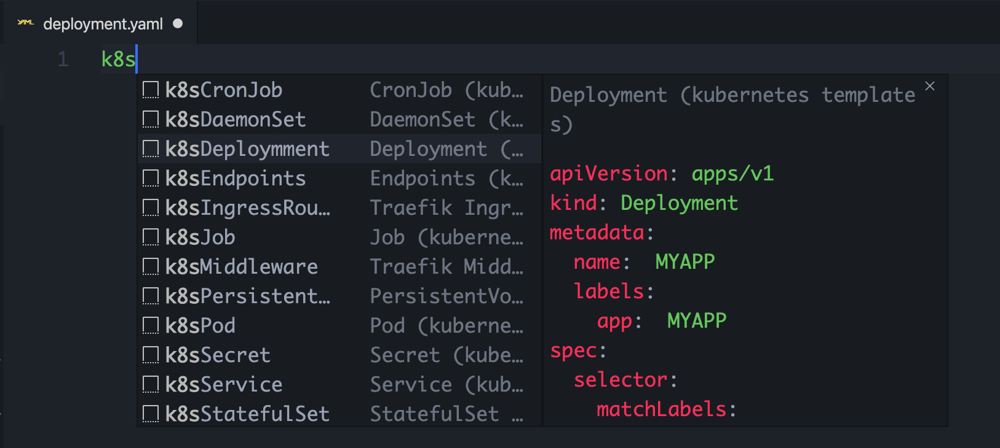

# kubernetes-templates

Are you still worried about how to create kubernetes resources? Are you still worried that the resources you created do not meet the requirements?
Let me help you, kubernetes-templates can help you quickly generate YAML files that define kubernetes resources.

How to use this extension?
- Create a YAML file, enter k8s, you will see a list of commonly used kubernetes resources, select the resource object you want to create

## Requirements
- Kubernetes >= 1.15.6
- Visual Studio Code >= 1.38

## Known Issues
- No Issues found, welcome

## Release Notes

### 1.0.0
- Add commonly used kubernetes objects
    - ConfigMap
    - Secret
    - Service
    - Endpoints
    - PersistentVolumeClaim
    - Deployment
    - DaemonSet
    - StatefulSet
    - Pod
    - Job
    - CronJob
    - Traefik IngressRoute
    - Traefik Middleware

### 0.0.1
- Initial release of ...

-----------------------------------------------------------------------------------------------------------

**Enjoy!**
